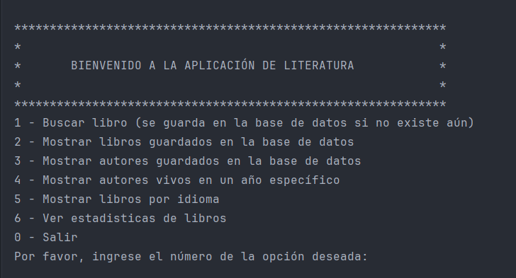
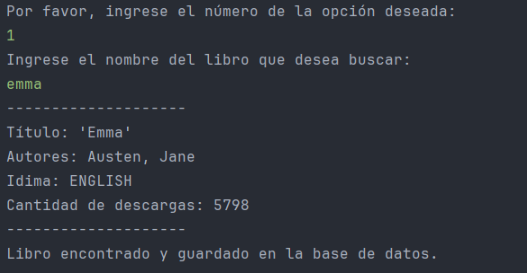
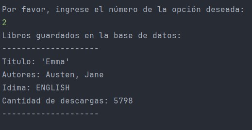
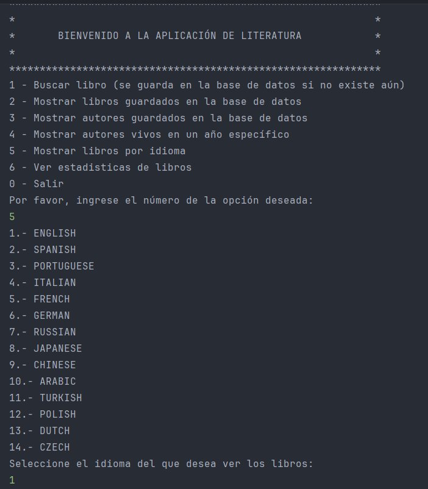
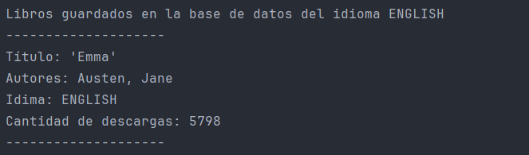
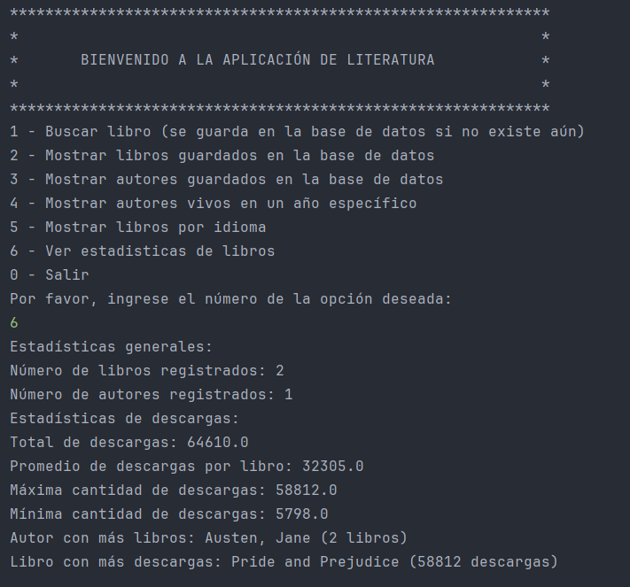

# LiterAlura | Book Manager

**LiterAlura** is a book catalog app built with **Java Spring Boot** that allows users to search, filter, and display book information from an external API. The app stores the data in a **PostgreSQL** database and offers a text-based console interface with interactive options.

<p align="left">
	
	
	
	
</p>
<p align="left">Built with the tools and technologies:</p>
<p align="left">
	
	
	
	
</p>

## 🚀 Technologies Used

- **Java JDK**: Version 17 or higher
- **Maven**: Version 4 or higher
- **Spring Boot**: Version 3.2.3
- **PostgreSQL**: Version 16 or higher
- **Jackson**: For JSON processing

## ✨ Features

- Search books from the **Gutendex API** (public domain books).
- Store and manage book data in a PostgreSQL database.
- Interact with the catalog via the console with at least **5 different options** (search, filter, view book details, etc.).
- Display information about books and authors that match your interests.

## 📸 Screenshots

### App Menu:


### Search for a book:


### List saved books:


### Filter books by language:




### Show statistics:


## 🛠️ How to Run

### 📋 Prerequisites

- **Java 17+**
- **Maven 4+**
- **PostgreSQL 16+** (configured and running)

### 🔧 Setup Instructions

1. Clone this repository:
   ```bash
   git clone https://github.com/JosueVazqJim/LiterAlura-Book-Manager.git